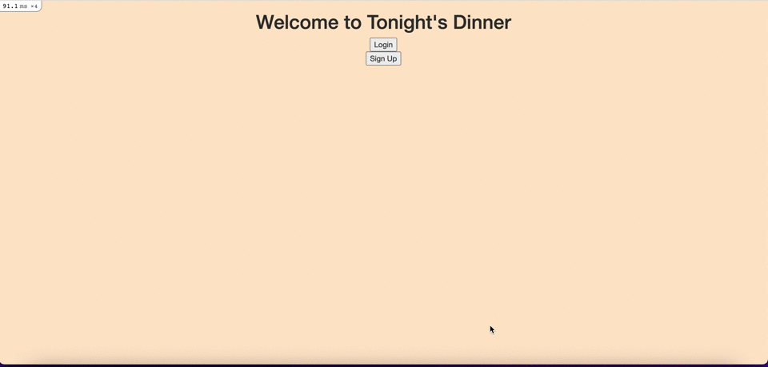

# Tonight's Dinner 

## My Approach
Created a web-app that allows me to input, store and search the dinners I cook in the evening. Helpful for tracking what I eat and what I can make. Contains CRUD elements working successfully to add dinner, edit posting and delete food. 

Also contains a "I'm Feeling Hungry" feature, where when clicked, runs a function that randomly displays a dinner from the database, if the user is unsure what to eat.

Inspired by the [r/tonightsdinner](https://www.reddit.com/r/tonightsdinner/) subreddit on Reddit and my passion for food.

Hosted publicly on Heroku: https://tonights-dinner.herokuapp.com/

## Demo



## How to run locally
```
git clone https://github.com/coo990/tonights-dinner.git
cd tonights-dinner
// Install gems
bundle install
// Create database
rake db:create
// Run server
bin/rails server
open http://localhost:3000/
```

## Sketch idea


## Technology used
- Ruby on Rails
- Capybara
- Rspec
- HTML/CSS
- Bootstrap
- Postgresql (Changed from SQLite from development)
- Heroku

## Future possible features:
 - Recipe suggestions using recipe APIs within the page.
 - ~~Login/Signup capabilities.~~ Updated 28/02
 - ~~Search function.~~
 - Upload images to food.
 - ~~Publicly hosted.~~ Updated 03/03

## How to feature test
```
git clone https://github.com/coo990/tonights-dinner.git
cd tonights-dinner
bundle install
rspec spec/features
```